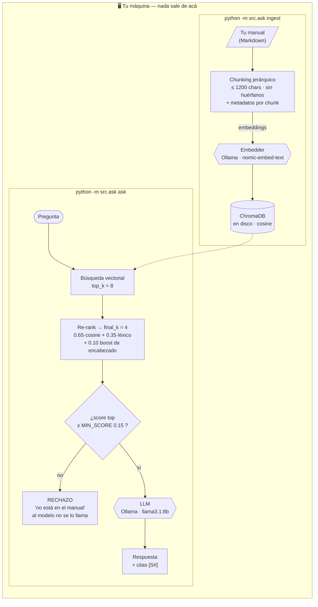

# private-clinical-rag

**Un pipeline RAG 100% local y con trazabilidad por citas para manuales de referencia críticos — corre en hardware propio, con cero fuga de datos.**

[English](README.md) · [Español](README.es.md)


-000000?logo=ollama&logoColor=white)


[](https://github.com/msemino/private-clinical-rag/actions/workflows/selftest.yml)

---

## Por qué existe

La mayoría de los demos de "RAG en 50 líneas" hacen tres cosas que los descartan
para dominios serios: cargan los documentos como si fueran prosa, confían en la
similitud vectorial cruda, y responden incluso cuando no deberían. En un entorno
de referencia crítico —clínico, legal, regulatorio— si una respuesta no tiene
trazabilidad, no es una funcionalidad: es deuda técnica.

Este proyecto es lo opuesto. Trata al manual como una **jerarquía de unidades
lógicas**, enriquece cada fragmento con metadatos, re-rankea más allá del coseno,
**cita sus fuentes** y **se niega a responder** cuando el contexto recuperado no
respalda una respuesta. Todo —embeddings, vector store y el LLM— corre **local**.
Ningún documento, consulta ni embedding sale jamás de la máquina.

> ### El caso que lo originó: "Bianca"
> Este pipeline nació de **Bianca**, un asistente privado sobre el manual de
> salud mental **DSM-5**. Como el DSM-5 tiene copyright, **este repositorio no
> incluye contenido del DSM-5** —ni el corpus, ni excerpts—. Incluye la
> *arquitectura* y un pequeño documento de ejemplo **sintético** para correrlo en
> 30 segundos; después lo apuntás a tu propio corpus con licencia. Ver
> [Traé tu propio corpus](#traé-tu-propio-corpus).

---

## Arquitectura

Dos comandos separados sobre el mismo store local. Cada caja mapea a código real
— la tabla que sigue al diagrama da el archivo y la función de cada una.



| Caja | Dónde vive |
|---|---|
| Chunking jerárquico | `src/ingest.py` — `parse_markdown()` recorre el árbol de encabezados, `_split_text()` corta en `_MAX_CHARS = 1200`; `flush()` descarta un cuerpo sin heading padre en vez de indexarlo a medias |
| Embedder | `src/embeddings.py` — `OllamaEmbedder` (prod) / `HashEmbedder` (offline), elegido por `get_embedder()` |
| ChromaDB | `src/ingest.py` — `PersistentClient` + `create_collection(metadata={"hnsw:space": "cosine"})`. Re-ingestar reconstruye la colección: nunca duplica |
| Búsqueda vectorial | `src/retrieve.py` — `collection.query(n_results=config.top_k)`; `TOP_K = 8` en `src/config.py` |
| Re-rank | `src/retrieve.py` — `_rerank()`: `0.65 * vec_score + 0.35 * overlap + heading_boost`, con `heading_boost = 0.10`; se queda con `FINAL_K = 4` |
| Compuerta de rechazo | `src/llm.py` — `if not contexts or contexts[0]["score"] < config.min_score: return REFUSAL`; `MIN_SCORE = 0.15` |
| LLM | `src/llm.py` — `_ollama_chat()` → `POST /api/generate`, `LLM_MODEL = llama3.1:8b` |

**Velo animado:** la [página del proyecto](https://private-clinical-rag.vercel.app) corre estos
tres caminos — indexado, respuesta con respaldo y rechazo — como diagrama en vivo.

---

## Arranque rápido

### 1. Ejecutalo offline en 30 segundos (sin GPU, sin Ollama)

```bash
python -m venv .venv && . .venv/Scripts/activate   # Linux/Mac: source .venv/bin/activate
pip install -r requirements.txt
python -m src.ask selftest
```

El self-test indexa el sample sintético con un embedder offline determinístico y
verifica todo el contrato: chunks indexados → sección correcta recuperada →
respuesta que cita su fuente → pregunta off-topic **rechazada**.

### 2. Ejecutalo de verdad (Ollama local)

```bash
ollama pull nomic-embed-text
ollama pull llama3.1:8b

cp .env.example .env
python -m src.ask ingest data/sample/clinical_handbook_sample.md
python -m src.ask ask "¿Cómo se evalúa un episodio de pánico?"
```

Cada respuesta vuelve con el path de sección de cada fuente usada.

---

## Cómo funciona (lo que importa)

| Decisión | Por qué |
|---|---|
| **Chunking jerárquico** | Los documentos se cortan siguiendo el árbol de títulos; cada fragmento conserva su path de sección completo. Un fragmento que perdería el contexto del padre se **descarta**, no se indexa a ciegas. |
| **"DNI" de metadatos por chunk** | Fuente, título, path de sección, ordinal — para aplicar filtros `where` quirúrgicos *antes* de que el LLM vea la consulta. |
| **Re-ranking, no similitud cruda** | Los candidatos del vector store se re-rankean con una mezcla transparente de coseno, solapamiento léxico y boost por match de título. Auditable, microsegundos, sin dependencia de cross-encoder. |
| **Compuerta de rechazo** | Si el mejor chunk puntúa por debajo de `MIN_SCORE`, devuelve *"no lo encuentro en el manual"* en vez de alucinar. |
| **Citas** | El prompt prohíbe conocimiento externo y exige tags `[S#]`; las fuentes se imprimen con cada respuesta. |
| **Local por construcción** | Embeddings (Ollama), vector store (ChromaDB en disco) y generación (Ollama) corren en tu hardware. **Cero fuga de datos.** |
| **Embedder enchufable** | `OllamaEmbedder` para producción, `HashEmbedder` para offline/CI — misma interfaz, pipeline testeable sin ningún servicio corriendo. El CI corre `python -m src.ask selftest` en cada push: el contrato completo se verifica sin Ollama y sin GPU. |

---

## Traé tu propio corpus

El repo incluye un sample **sintético** (`data/sample/clinical_handbook_sample.md`)
—contenido ficticio escrito para este proyecto, **no** el DSM-5 ni ningún manual
con copyright—. Para usarlo de verdad:

1. Poné tus documentos Markdown **con licencia** bajo `data/` (la carpeta
   `data/private/` está git-ignored por default).
2. `python -m src.ask ingest "data/private/*.md"`
3. `python -m src.ask ask "tu pregunta"`

> ⚠️ **Sos responsable de los derechos del corpus que indexes.** No subas material
> con copyright a un repo público. Esta herramienta mantiene tu corpus local
> justamente para que siga siendo privado.

> 🩺 **No es consejo médico.** Es una herramienta de recuperación y citado sobre
> un manual, no un sistema de diagnóstico.

---

## El trade-off, dicho sin vueltas

La compuerta de rechazo es el punto de este proyecto, así que sus límites tienen
que leerse tan claro como sus aciertos. Los tres se observan en la salida del self-test:

* **Lee solo `contexts[0]`.** La compuerta compara contra `MIN_SCORE` el score del
  chunk *top*. Los otros `final_k - 1` chunks que llenan el prompt no pasan por
  ninguna compuerta individual — en el self-test offline, la cuarta fuente citada
  puntúa **0.00** y llega igual al modelo. Es tolerable porque el score viaja con
  cada cita (`llm.py`) y se imprime al lado (`ask.py`), así que se ve exactamente
  qué tan flaca era una fuente. Pero la compuerta no lo frena.
* **El score es una mezcla, no un cross-encoder.** Una respuesta correcta redactada
  distinto al manual puede caer bajo `MIN_SCORE` y quedar rechazada igual: menos
  respuestas erradas, pero también menos respuestas. Subir `MIN_SCORE` cambia
  recall por cautela; bajarlo hace lo inverso. En un contexto de referencia
  clínica, el default se inclina a rechazar.
* **El embedder offline no es uno real.** `HashEmbedder` es bag-of-words
  determinista. Existe para que el pipeline sea demostrable de punta a punta sin
  ningún servicio — no reemplaza a `nomic-embed-text`, y los scores que produce
  no son los de producción.

---

## Licencia

[MIT](LICENSE) para el código. El sample sintético es contenido original bajo la
misma licencia. Cualquier corpus que *vos* agregues se rige por *su* licencia.
