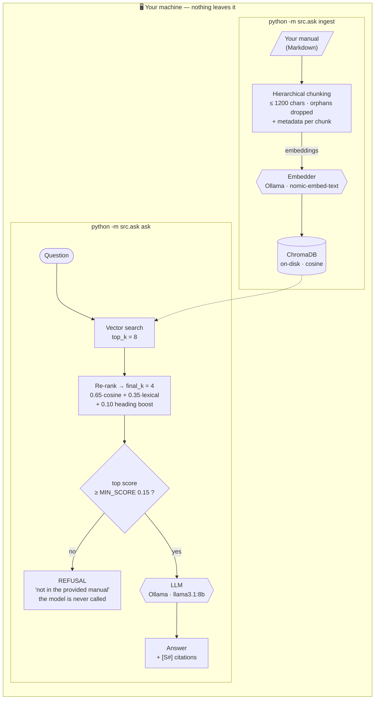
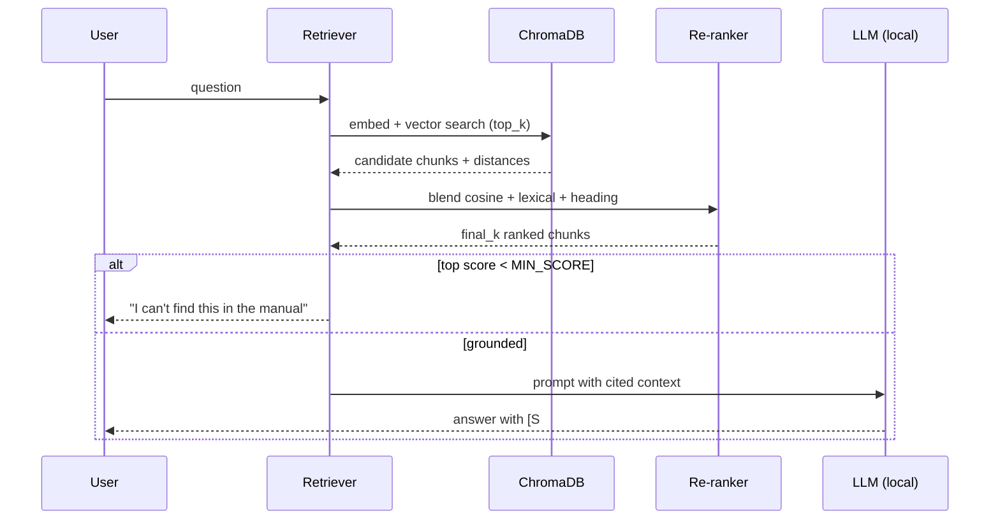

# private-clinical-rag

**A fully local, citation-grade RAG pipeline for high-stakes reference manuals — runs on hardware you own, with zero data egress.**

[English](README.md) · [Español](README.es.md)


-000000?logo=ollama&logoColor=white)


[](https://github.com/msemino/private-clinical-rag/actions/workflows/selftest.yml)

---

## Why this exists

Most "RAG in 50 lines" demos do three things that quietly disqualify them from
serious domains: they feed documents as if they were prose, they trust raw
vector similarity, and they answer even when they shouldn't. In a high-stakes
reference setting — clinical, legal, regulatory — if an answer has no
traceability, it isn't a feature, it's technical debt.

This project is the opposite. It treats the manual as a **hierarchy of logical
units**, enriches every chunk with metadata, re-ranks beyond cosine similarity,
**cites its sources**, and **refuses to answer** when the retrieved context
doesn't support a response. Everything — embeddings, vector store, and the LLM —
runs **locally**. No document, no query, and no embedding ever leaves the
machine.

> ### The motivating case: "Bianca"
> This pipeline grew out of **Bianca**, a private assistant over the **DSM-5**
> mental-health manual. Because the DSM-5 is copyrighted, **this repository ships
> no DSM-5 content** — not the corpus, not excerpts. It ships the *architecture*
> and a small **synthetic** sample so you can run it in 30 seconds, then point it
> at your own licensed corpus. See [Bring your own corpus](#bring-your-own-corpus).

---

## Architecture

Two separate commands over the same local store. Every box below maps to real
code — the table after the diagram gives the file and function for each one.



| Box | Where it lives |
|---|---|
| Hierarchical chunking | `src/ingest.py` — `parse_markdown()` walks the heading tree, `_split_text()` caps pieces at `_MAX_CHARS = 1200`; `flush()` drops a body with no heading parent instead of indexing it half-blind |
| Embedder | `src/embeddings.py` — `OllamaEmbedder` (prod) / `HashEmbedder` (offline), chosen by `get_embedder()` |
| ChromaDB | `src/ingest.py` — `PersistentClient` + `create_collection(metadata={"hnsw:space": "cosine"})`. Re-ingesting rebuilds the collection, so it never duplicates |
| Vector search | `src/retrieve.py` — `collection.query(n_results=config.top_k)`; `TOP_K = 8` in `src/config.py` |
| Re-rank | `src/retrieve.py` — `_rerank()`: `0.65 * vec_score + 0.35 * overlap + heading_boost`, `heading_boost = 0.10`; keeps `FINAL_K = 4` |
| Refusal gate | `src/llm.py` — `if not contexts or contexts[0]["score"] < config.min_score: return REFUSAL`; `MIN_SCORE = 0.15` |
| LLM | `src/llm.py` — `_ollama_chat()` → `POST /api/generate`, `LLM_MODEL = llama3.1:8b` |

**See it animated:** the [project page](https://private-clinical-rag.vercel.app) runs these three
paths — indexing, a grounded answer, and the refusal — as a live diagram.

---

## Quickstart

### 1. Run it offline in 30 seconds (no GPU, no Ollama)

```bash
python -m venv .venv && . .venv/Scripts/activate   # Linux/Mac: source .venv/bin/activate
pip install -r requirements.txt
python -m src.ask selftest
```

The self-test indexes the synthetic sample with a deterministic offline embedder
and asserts the full contract: chunks indexed → correct section retrieved →
answer cites its source → off-topic question is **refused**.

```
PASS: indexed 13 chunks
PASS: top section for panic query -> ... > Anxiety Presentations > Panic Episodes
PASS: grounded answer cited 4 source(s)
PASS: off-topic query refused instead of hallucinating
```

### 2. Run it for real (local Ollama)

```bash
# one-time: pull a small embedder + a chat model
ollama pull nomic-embed-text
ollama pull llama3.1:8b

cp .env.example .env          # defaults already point at local Ollama
python -m src.ask ingest data/sample/clinical_handbook_sample.md
python -m src.ask ask "How is a panic episode assessed?"
```

Every answer comes back with the section path of each source it used.

---

## How it works (the parts that matter)

| Decision | Why |
|---|---|
| **Hierarchical chunking** | Documents are split along their heading tree; each chunk keeps its full section path (`Anxiety > Panic Episodes > Assessment`). A chunk that would lose its parent context is **dropped**, not indexed half-blind. |
| **Metadata "DNI" per chunk** | Source, heading, section path, ordinal — so you can apply surgical `where` filters *before* the LLM sees the query. |
| **Re-ranking, not raw similarity** | Candidates from the vector store are re-ranked with a transparent blend of cosine score, lexical overlap, and a heading-match boost. Auditable, microsecond-cheap, no cross-encoder dependency (swap one in later if needed). |
| **Refusal gate** | If the best chunk scores below `MIN_SCORE`, the system returns *"I can't find this in the provided manual"* instead of hallucinating. |
| **Citations** | The prompt forbids outside knowledge and requires inline `[S#]` tags; sources are printed with every answer. |
| **Local by construction** | Embeddings (Ollama), vector store (ChromaDB on disk), and generation (Ollama) all run on your hardware. **Zero data egress.** |
| **Pluggable embedder** | `OllamaEmbedder` for production, `HashEmbedder` for offline/CI — same interface, so the pipeline is testable without any service running. CI runs `python -m src.ask selftest` on every push: the full contract is checked with no Ollama and no GPU. |

### Query flow



---

## Bring your own corpus

The repo ships a **synthetic** sample (`data/sample/clinical_handbook_sample.md`)
— fictional content authored for this project, **not** the DSM-5 or any
copyrighted manual. To use it for real:

1. Put your **licensed** Markdown documents anywhere under `data/` (the
   `data/private/` folder is git-ignored by default).
2. `python -m src.ask ingest "data/private/*.md"`
3. `python -m src.ask ask "your question"`

> ⚠️ **You are responsible for the rights to whatever corpus you index.** Do not
> commit copyrighted material to a public repository. This tool keeps your corpus
> local precisely so it can stay private.

> 🩺 **Not medical advice.** This is a retrieval-and-citation tool over a manual,
> not a diagnostic system. It summarizes the document you give it; it does not
> reason about individuals.

---

## The trade-off, stated plainly

The refusal gate is the point of this project, so its limits should be as legible
as its wins. Both of these are observable in the self-test output:

* **It reads `contexts[0]` only.** The gate compares the *top* chunk's score to
  `MIN_SCORE`. The remaining `final_k - 1` chunks that fill the prompt are never
  gated individually — in the offline self-test, the fourth cited source scores
  **0.00** and still reaches the model. That is survivable because the score
  travels with every citation (`llm.py`) and is printed next to it (`ask.py`), so
  a reader can see exactly how thin a source was. But the gate does not stop it.
* **The score is a blend, not a cross-encoder.** A correct answer worded
  differently from the manual can fall under `MIN_SCORE` and be refused anyway:
  fewer wrong answers, but also fewer answers. Raising `MIN_SCORE` trades recall
  for caution; lowering it does the reverse. In a clinical reference setting the
  default leans toward refusing.
* **The offline embedder is not a real one.** `HashEmbedder` is deterministic
  bag-of-words. It exists so the pipeline is provable end-to-end with zero
  services — it is not a substitute for `nomic-embed-text`, and the scores it
  produces are not the scores you get in production.

---

## Project layout

```
private-clinical-rag/
├── src/
│   ├── config.py      # env-driven config (all local by default)
│   ├── embeddings.py  # Ollama (prod) + Hash (offline) embedders
│   ├── ingest.py      # hierarchical chunking + metadata → ChromaDB
│   ├── retrieve.py    # vector search + transparent re-ranking
│   ├── llm.py         # cited generation + refusal gate
│   └── ask.py         # CLI: ingest / ask / selftest
└── data/sample/       # synthetic sample doc (NOT the DSM-5)
```

## License

[MIT](LICENSE) — for the code. The synthetic sample is original content released
under the same license. Any corpus *you* add is governed by *its* license.
