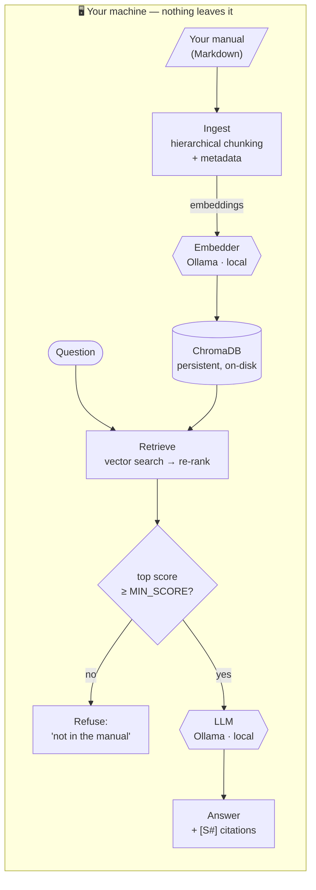
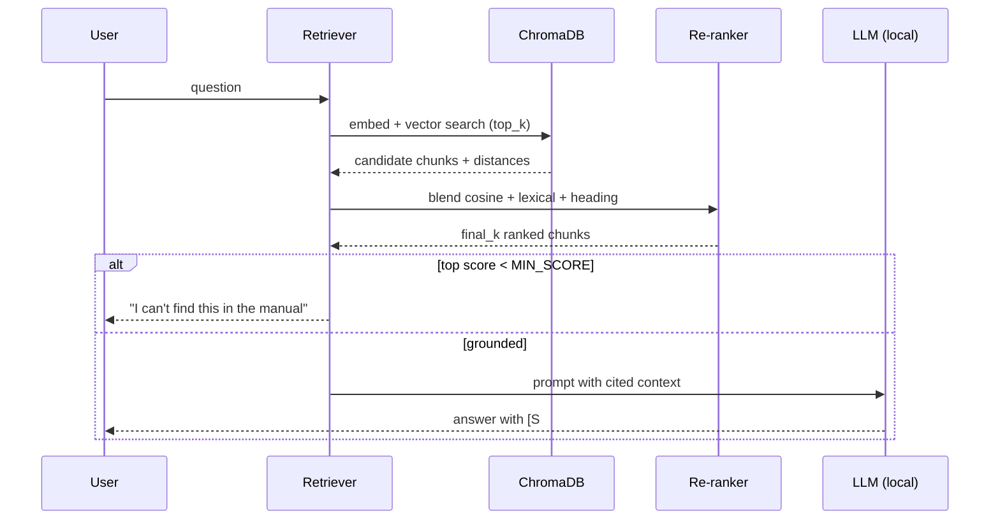

# private-clinical-rag

**A fully local, citation-grade RAG pipeline for high-stakes reference manuals — runs on hardware you own, with zero data egress.**

[English](README.md) · [Español](README.es.md)


-000000?logo=ollama&logoColor=white)


---

## Why this exists

Most "RAG in 50 lines" demos do three things that quietly disqualify them from
serious domains: they feed documents as if they were prose, they trust raw
vector similarity, and they answer even when they shouldn't. In a high-stakes
reference setting — clinical, legal, regulatory — if an answer has no
traceability, it isn't a feature, it's technical debt.

This project is the opposite. It treats the manual as a **hierarchy of logical
units**, enriches every chunk with metadata, re-ranks beyond cosine similarity,
**cites its sources**, and **refuses to answer** when the retrieved context
doesn't support a response. Everything — embeddings, vector store, and the LLM —
runs **locally**. No document, no query, and no embedding ever leaves the
machine.

> ### The motivating case: "Bianca"
> This pipeline grew out of **Bianca**, a private assistant over the **DSM-5**
> mental-health manual. Because the DSM-5 is copyrighted, **this repository ships
> no DSM-5 content** — not the corpus, not excerpts. It ships the *architecture*
> and a small **synthetic** sample so you can run it in 30 seconds, then point it
> at your own licensed corpus. See [Bring your own corpus](#bring-your-own-corpus).

---

## Architecture



---

## Quickstart

### 1. Run it offline in 30 seconds (no GPU, no Ollama)

```bash
python -m venv .venv && . .venv/Scripts/activate   # Linux/Mac: source .venv/bin/activate
pip install -r requirements.txt
python -m src.ask selftest
```

The self-test indexes the synthetic sample with a deterministic offline embedder
and asserts the full contract: chunks indexed → correct section retrieved →
answer cites its source → off-topic question is **refused**.

```
PASS: indexed 13 chunks
PASS: top section for panic query -> ... > Anxiety Presentations > Panic Episodes
PASS: grounded answer cited 4 source(s)
PASS: off-topic query refused instead of hallucinating
```

### 2. Run it for real (local Ollama)

```bash
# one-time: pull a small embedder + a chat model
ollama pull nomic-embed-text
ollama pull llama3.1:8b

cp .env.example .env          # defaults already point at local Ollama
python -m src.ask ingest data/sample/clinical_handbook_sample.md
python -m src.ask ask "How is a panic episode assessed?"
```

Every answer comes back with the section path of each source it used.

---

## How it works (the parts that matter)

| Decision | Why |
|---|---|
| **Hierarchical chunking** | Documents are split along their heading tree; each chunk keeps its full section path (`Anxiety > Panic Episodes > Assessment`). A chunk that would lose its parent context is **dropped**, not indexed half-blind. |
| **Metadata "DNI" per chunk** | Source, heading, section path, ordinal — so you can apply surgical `where` filters *before* the LLM sees the query. |
| **Re-ranking, not raw similarity** | Candidates from the vector store are re-ranked with a transparent blend of cosine score, lexical overlap, and a heading-match boost. Auditable, microsecond-cheap, no cross-encoder dependency (swap one in later if needed). |
| **Refusal gate** | If the best chunk scores below `MIN_SCORE`, the system returns *"I can't find this in the provided manual"* instead of hallucinating. |
| **Citations** | The prompt forbids outside knowledge and requires inline `[S#]` tags; sources are printed with every answer. |
| **Local by construction** | Embeddings (Ollama), vector store (ChromaDB on disk), and generation (Ollama) all run on your hardware. **Zero data egress.** |
| **Pluggable embedder** | `OllamaEmbedder` for production, `HashEmbedder` for offline/CI — same interface, so the pipeline is testable without any service running. |

### Query flow



---

## Bring your own corpus

The repo ships a **synthetic** sample (`data/sample/clinical_handbook_sample.md`)
— fictional content authored for this project, **not** the DSM-5 or any
copyrighted manual. To use it for real:

1. Put your **licensed** Markdown documents anywhere under `data/` (the
   `data/private/` folder is git-ignored by default).
2. `python -m src.ask ingest "data/private/*.md"`
3. `python -m src.ask ask "your question"`

> ⚠️ **You are responsible for the rights to whatever corpus you index.** Do not
> commit copyrighted material to a public repository. This tool keeps your corpus
> local precisely so it can stay private.

> 🩺 **Not medical advice.** This is a retrieval-and-citation tool over a manual,
> not a diagnostic system. It summarizes the document you give it; it does not
> reason about individuals.

---

## Project layout

```
private-clinical-rag/
├── src/
│   ├── config.py      # env-driven config (all local by default)
│   ├── embeddings.py  # Ollama (prod) + Hash (offline) embedders
│   ├── ingest.py      # hierarchical chunking + metadata → ChromaDB
│   ├── retrieve.py    # vector search + transparent re-ranking
│   ├── llm.py         # cited generation + refusal gate
│   └── ask.py         # CLI: ingest / ask / selftest
└── data/sample/       # synthetic sample doc (NOT the DSM-5)
```

## License

[MIT](LICENSE) — for the code. The synthetic sample is original content released
under the same license. Any corpus *you* add is governed by *its* license.
